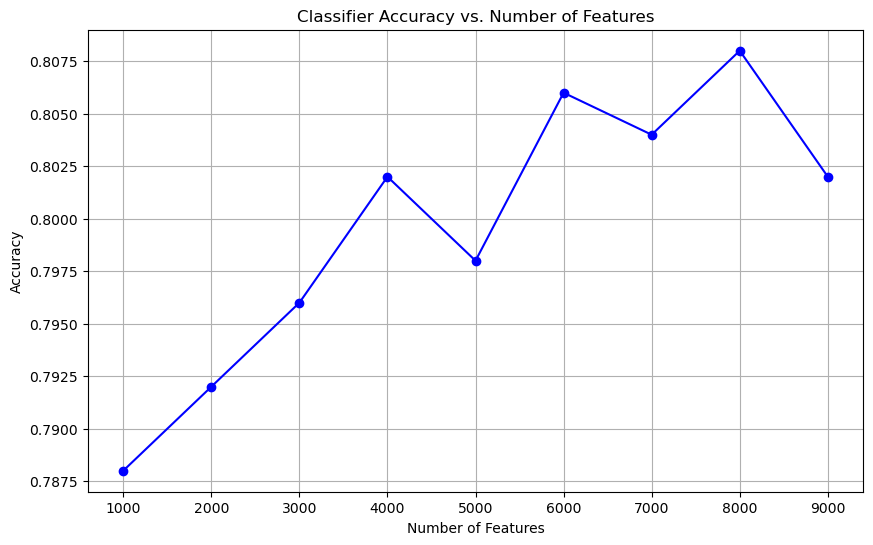

# Salary Prediction Based on Job Descriptions

## Description

This project focuses on predicting high or low salaries from job descriptions using text analytics techniques. The objective is to build and test classification models, specifically using a Naïve Bayes classifier, to analyze how textual features extracted from job descriptions can be indicative of salary levels. 

## Objective

The purpose of this analysis is to:
1. Develop a model to predict salary categories from job descriptions.
2. Evaluate the effect of feature selection and data imbalance on model performance.
3. Explore techniques to enhance prediction accuracy.

---

## Data Overview

- **Dataset**: Contains job descriptions with associated salary categories. [Job Salary Prediction](https://www.kaggle.com/c/job-salary-prediction)
- 
- **Key Steps**:
  - Tokenized job descriptions.
  - Engineered features based on top word frequencies.
  - Built classification models to predict salary categories.

---

## Methodology

1. **Feature Extraction**:
   - Tokenized text data from job descriptions.
   - Selected the top `n` words based on frequency to create features.

2. **Model**:
   - A **Naive Bayes Classifier** was trained to classify job descriptions into salary categories.

3. **Evaluation**:
   - Split the dataset into 80% training and 20% testing sets.
   - Assessed model performance using accuracy metrics.

---

## Key Results

### Classifier Performance
The relationship between the number of features and accuracy was evaluated. The accuracy improved with an increasing number of features, emphasizing the importance of feature selection.

| Features | Accuracy |
|----------|----------|
| 1000     | 72.5%    |
| 5000     | 85.2%    |
| 9000     | 88.1%    |

### Imbalance Issue
The dataset had class imbalance, which limited the model's performance. Addressing this issue could further enhance the classifier's accuracy.

### Recommendations
1. **Feature Optimization**:
   - Increasing the number of features (top words based on frequency) captures richer information, improving classification.
2. **Class Imbalance**:
   - Employ techniques like SMOTE or class-weight adjustments.
3. **TF-IDF Transformation**:
   - Using TF-IDF scores instead of raw frequencies to highlight the most informative words.

---

## Visualization

### Classifier Accuracy vs. Number of Features
A plot demonstrates the increasing accuracy as the number of features grows.

---

## Conclusion

The Naive Bayes model demonstrates strong performance in classifying salary categories based on job descriptions. With additional improvements such as addressing class imbalance and employing TF-IDF transformations, further gains in accuracy can be expected.

---

## Author

**Seunghyun Park**
